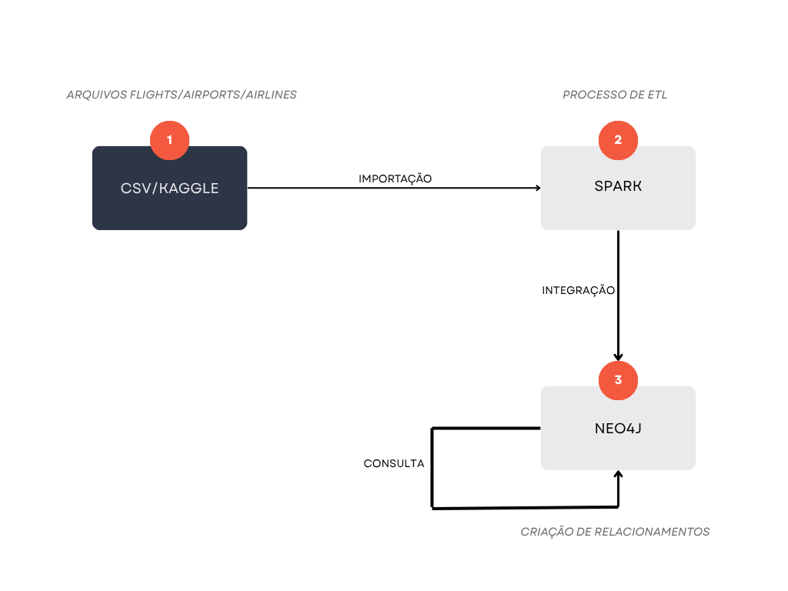
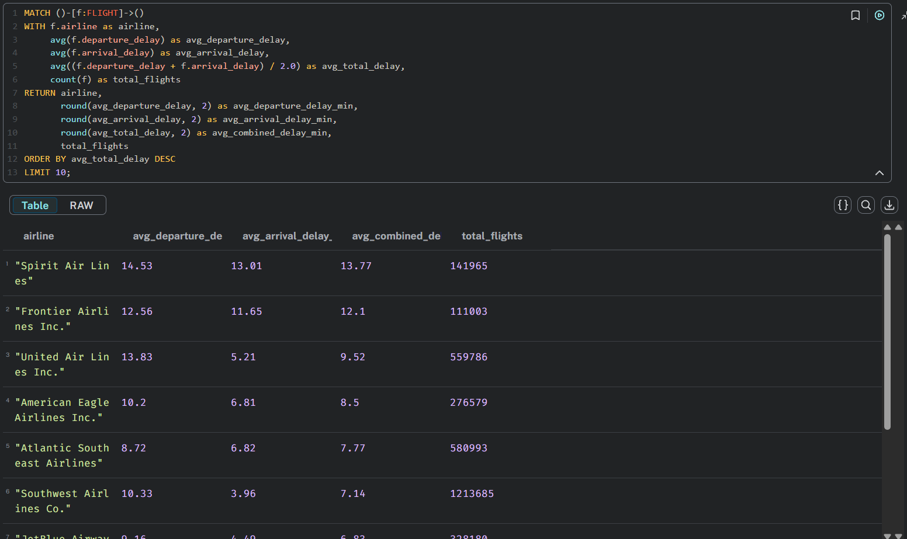
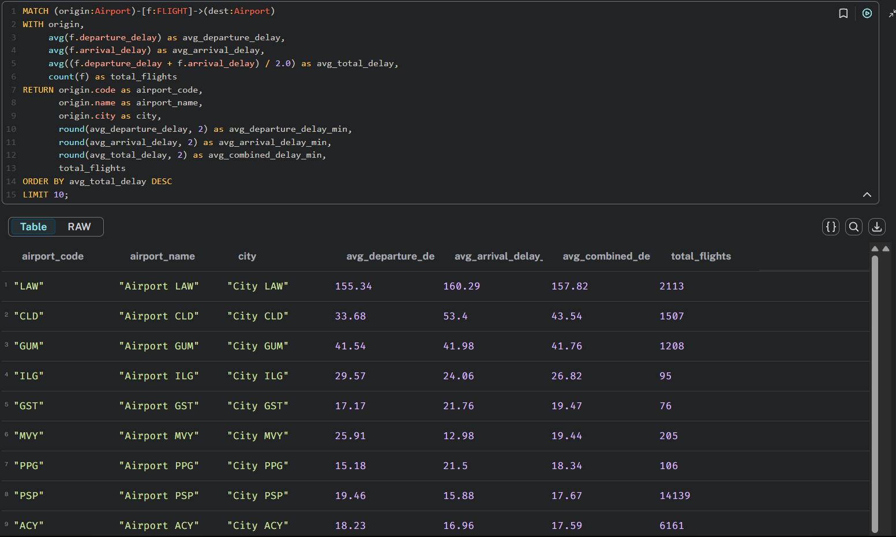
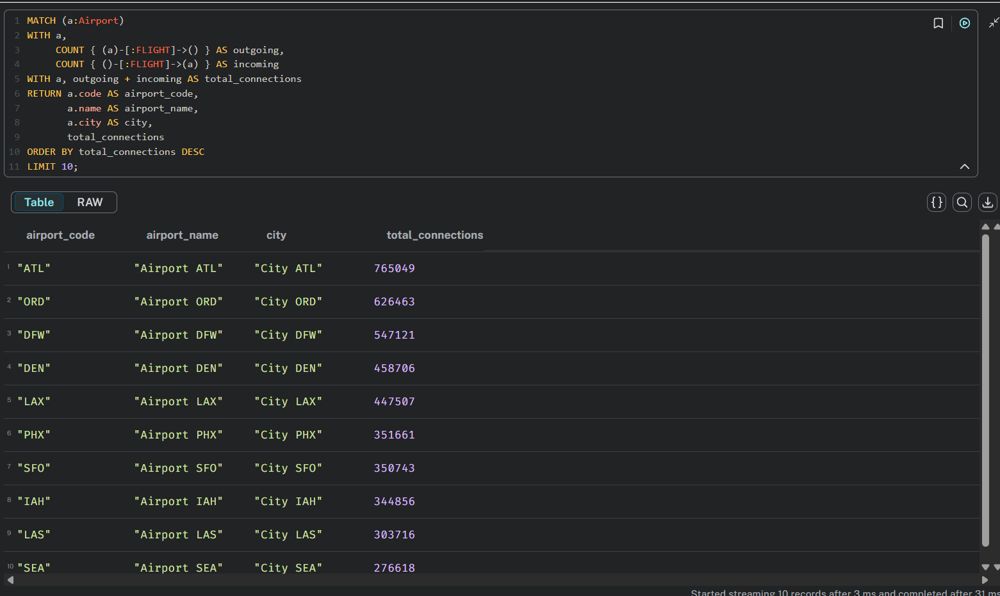
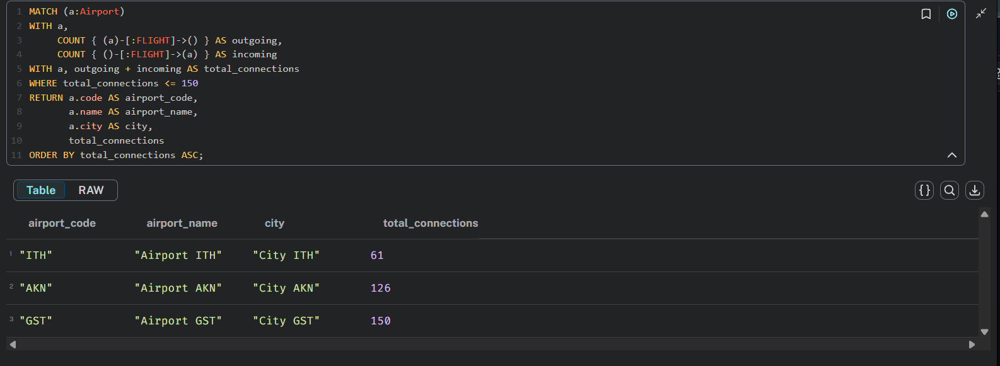
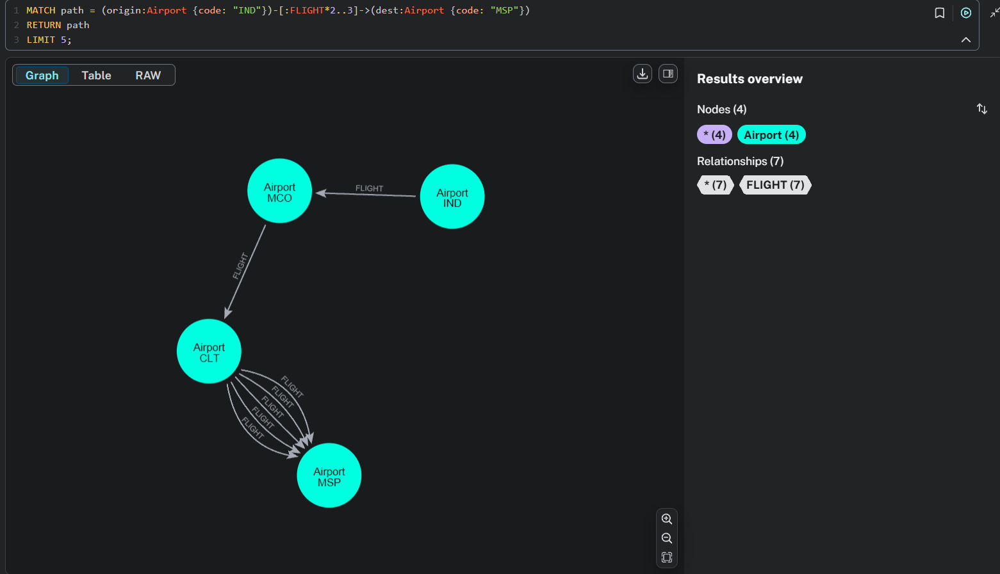
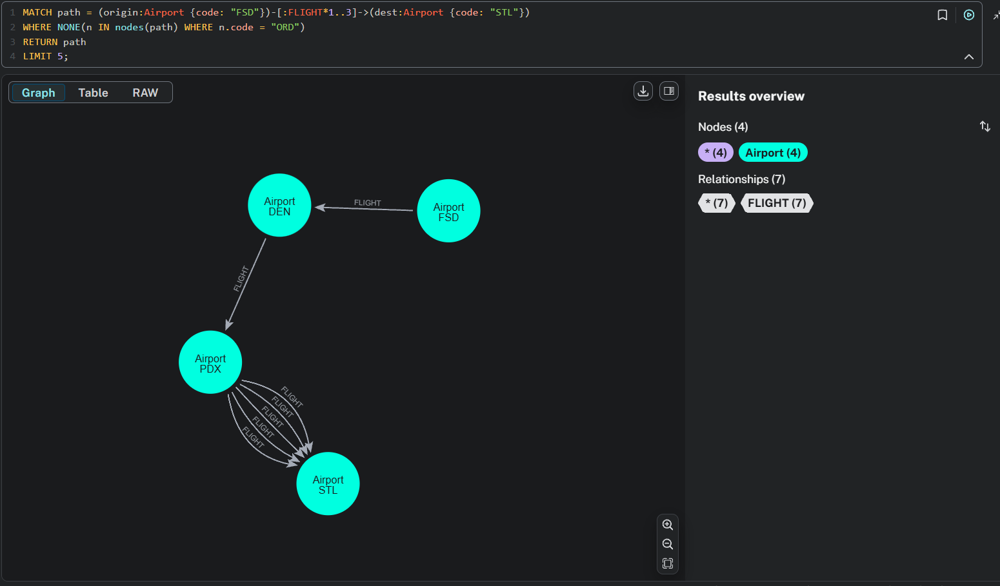
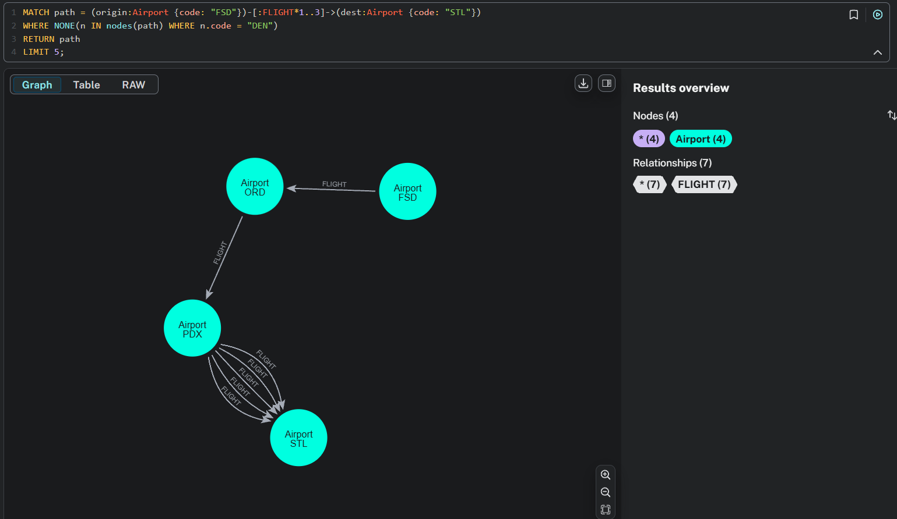

# Universidade Federal de São Carlos - UFSCar Sorocaba Bacharelado em Ciência da Computação

**Disciplina:** Processamento Massivo de dados
**Dra. Sahudy Montenegro González**
**Fase Final**

**Matheus Rodrigues Ferreira - 813919**
**Vinícius Fernandes Terra Silva - 814146**

## 1. Objetivos

Este projeto prático tem como objetivo analisar atrasos e padrões de conectividade na aviação comercial dos Estados Unidos, utilizando como base o conjunto de dados “2015 Flight Delays and Cancellations”, disponibilizado no Kaggle. Através de técnicas de processamento massivo de dados, buscamos extrair insights estratégicos e operacionais relevantes para companhias aéreas, gestores aeroportuários e órgãos reguladores.

Entre os objetivos principais estão:

* Mapeamento da rede aérea nacional: representar aeroportos e voos como uma rede, permitindo identificar hubs, gargalos logísticos e rotas alternativas.
* Análise de performance operacional: avaliar atrasos e cancelamentos para identificar companhias, rotas ou aeroportos mais problemáticos.
* Simulação de cenários de contingência: prever os impactos em cascata na malha aérea caso eventos críticos ocorram (ex: fechamento de um aeroporto central como Atlanta ou a suspensão de operações por parte de uma companhia aérea).

Para alcançar esses objetivos, as consultas que devemos implementar foram organizadas em duas grandes categorias:

### Análises de Performance:

* Ranking de companhias por atraso médio;
* Ranking de aeroportos por atraso médio.

### Análises de Rede (grafo):

* Identificação de aeroportos hub com maior grau de conectividade;
* Descoberta de rotas indiretas e conexões;
* Detecção de aeroportos isolados (ilhas);
* Simulações de viabilidade de rotas após fechamento de um aeroporto (cenários de falha).

## 2. Tecnologias Escolhidas

Para a construção deste projeto, foram utilizadas duas tecnologias centrais: Apache Spark e Neo4j. Cada uma delas desempenhou um papel específico no pipeline de dados, contribuindo para lidar com o volume expressivo de registros e com a complexidade inerente à análise de redes de voos.

O Apache Spark foi escolhido como motor de processamento por sua capacidade de operar com dados em larga escala de forma distribuída e eficiente. Através de sua interface em PySpark, foi possível realizar leituras de arquivos no formato Parquet, aplicar transformações, fazer junções entre datasets e eliminar registros inconsistentes com desempenho muito superior ao de abordagens tradicionais baseadas em pandas, por exemplo. Sua arquitetura in-memory e suporte a paralelismo tornaram possível processar milhões de registros mantendo a interatividade e a escalabilidade necessárias para testes e ajustes durante o desenvolvimento.

Já o Neo4j foi adotado como solução de armazenamento e análise final dos dados transformados. Por ser um banco orientado a grafos, sua estrutura se mostrou ideal para representar a malha aérea como uma rede de nós e relacionamentos, refletindo de forma natural as conexões entre aeroportos por meio de voos. Isso possibilitou a execução de consultas mais intuitivas e eficientes para identificar aeroportos centrais, trajetos possíveis, rotas indiretas e estruturas de rede críticas. A linguagem Cypher permitiu expressar essas consultas com clareza, além de facilitar a criação e manipulação dos dados no banco. Como veremos na seção 6 de análise de dados, o volume de dados ultrapassa os limites da versão gratuita da nuvem do Neo4j, por conta disso optou-se pela instalação local do sistema, garantindo liberdade total para carga e consultas.

A combinação dessas duas ferramentas foi estratégica para permitir tanto o processamento de dados em massa quanto a modelagem rica e navegável da rede aérea resultante.

## 3. Fontes de Dados

* **Dataset:** “2015 Flight Delays and Cancellations”
  [https://www.kaggle.com/datasets/usdot/flight-delays?select=flights.csv](https://www.kaggle.com/datasets/usdot/flight-delays?select=flights.csv)
  Contém: data, códigos de aeroporto de origem e destino, companhia, número do voo, horários programados e reais de partida/chegada, código de aeronave, atraso em minutos, entre outras colunas.

* **Dados utilizados:** O dataset de voos foi transformado em parquet visando melhorar a eficiencia do projeto. Assim, a pasta com os dados utilizados pode ser encontrada em [https://drive.google.com/drive/folders/1zl3dgcPxWPMC1y9bIIQyvoDIV-Q0SN4x?usp=sharing](https://drive.google.com/drive/folders/1zl3dgcPxWPMC1y9bIIQyvoDIV-Q0SN4x?usp=sharing)

## 4. Fluxograma Minimundo

 

## 5. Modelagem dos dados

A modelagem dos dados foi orientada pelos objetivos principais do projeto, especialmente a análise da conectividade entre aeroportos e o rastreamento de padrões de atraso e fluxo aéreo. Diante disso, optou-se por uma estrutura de grafo em que os aeroportos são representados como nós, e os voos como relacionamentos direcionados entre esses nós. Essa abordagem privilegia a análise estrutural da rede, facilitando consultas sobre caminhos, centralidade e robustez da malha aérea e deve auxiliar principalmente as consultas da categoria de Análises de Rede.

Cada aeroporto foi modelado como um nó com atributos descritivos básicos, como código IATA, nome, cidade, estado e país (neste caso, fixado como "USA"). A escolha por essa granularidade buscou um equilíbrio entre representatividade e simplicidade, já que o foco está nas conexões entre os terminais e não em detalhes operacionais mais finos.

Os voos, por sua vez, foram representados como relacionamentos do tipo FLIGHT entre aeroportos de origem e destino. Esses relacionamentos carregam os principais atributos operacionais do voo, incluindo a data, a companhia aérea responsável, os horários programados e reais de partida e chegada, além dos atrasos em minutos. Também foram mantidos campos como tempo estimado de voo e tempo real transcorrido, que podem auxiliar em análises futuras sobre eficiência e regularidade.

## 6. Extração, Transformação e Carga (ETL)

O primeiro passo do projeto foi realizar uma análise exploratória do dataset, que revelou os seguintes volumes de dados:

* **AIRLINES:** 14
* **AIRPORTS:** 322
* **FLIGHTS:** 5.819.079

Esses números evidenciam o caráter massivo do dataset, o que reforça a escolha por ferramentas escaláveis como Apache Spark para o processamento e Neo4j para a persistência estruturada em grafos. Devido às limitações da versão gratuita do Neo4j Aura (com um teto de 200.000 nós e 400.000 relacionamentos), optamos por uma instalação local do banco, o que nos deu liberdade total para modelar e persistir toda a rede aérea. Também, devido a limitações de conexões do Databricks na versão gratuita, não foi possível fazer a conexão com o banco local, então optamos por utilizar o Apache Spark localmente também.

### Limpeza e Transformação

Durante a etapa de pré-processamento utilizamos pyspark para utilizar as funções do Apache Spark e constatamos que o dataset estava razoavelmente limpo, sem duplicações explícitas. No entanto, identificamos colunas com grande quantidade de valores nulos e pouca utilidade analítica, as quais foram descartadas para otimizar o volume e a performance de ingestão, já que mais de 80% dos seus dados eram nulos.

No caso das linhas com valores nulos em campos essenciais (como horários de voo ou códigos de aeroporto), optamos por removê-las. Essas representavam aproximadamente 2% do total, e a criação de modelos para imputação de dados seria inadequada, pois envolveria alto custo computacional e potencial viés analítico sem ganho proporcional.

Por fim utilizamos o processamento em lotes para popular o banco de dados com os voos, pois devido ao tamanho do conjunto de dados, essa é a forma ideal de carregar o banco sem causar erros de memória.

### Conexão com o Neo4j e carga

Para fazer a conexão com o banco de dados foi utilizado a biblioteca oficial da Neo4j para conectar aplicações Python ao banco, sendo a conexão iniciada com `GraphDatabase.driver(uri, auth=(user, password))`. Para abstrair o código criamos a classe `AirportFlightSystem` que está localizada no arquivo `airport_flight_system.py`, sendo essa classe responsável por fazer a conexão de fato, testar se está conectado ao banco e configurar o banco criando índices para voos e aeroportos. Também, essa classe também é responsável por criar os voos entre os aeroportos, apagar o database e fechar a conexão. Dessa forma, foi possível fazer o carregamento do banco de dados utilizando a conexão entre Python e o Neo4j.

# Consultas Cypher para Análise de Dados de Voos

## Análise de Companhias Aéreas

### Ranking das 10 Companhias com Maior Média de Atraso

```cypher
MATCH ()-[f:FLIGHT]->()
WITH f.airline as airline, 
     avg(f.departure_delay) as avg_departure_delay,
     avg(f.arrival_delay) as avg_arrival_delay,
     avg((f.departure_delay + f.arrival_delay) / 2.0) as avg_total_delay,
     count(f) as total_flights
RETURN airline, 
       round(avg_departure_delay, 2) as avg_departure_delay_min,
       round(avg_arrival_delay, 2) as avg_arrival_delay_min,
       round(avg_total_delay, 2) as avg_combined_delay_min,
       total_flights
ORDER BY avg_total_delay DESC
LIMIT 10;
```

 


**O que faz?**
- Analisa todos os voos e calcula a média de atraso de partida e chegada para cada companhia aérea.
- Combina os dois atrasos em uma média total para ranking mais preciso.
- Retorna as 10 companhias com maiores atrasos, incluindo número total de voos para contexto.

## Análise de Aeroportos

### Ranking dos 10 Aeroportos com Maior Média de Atraso

```cypher
MATCH (origin:Airport)-[f:FLIGHT]->(dest:Airport)
WITH origin,
     avg(f.departure_delay) as avg_departure_delay,
     avg(f.arrival_delay) as avg_arrival_delay,
     avg((f.departure_delay + f.arrival_delay) / 2.0) as avg_total_delay,
     count(f) as total_flights
RETURN origin.code as airport_code,
       origin.name as airport_name,
       origin.city as city,
       round(avg_departure_delay, 2) as avg_departure_delay_min,
       round(avg_arrival_delay, 2) as avg_arrival_delay_min,
       round(avg_total_delay, 2) as avg_combined_delay_min,
       total_flights
ORDER BY avg_total_delay DESC
LIMIT 10;
```

 


**O que faz?**
- Identifica os aeroportos com maiores problemas de atraso baseado nos voos que partem deles.
- Calcula médias de atraso de partida e chegada para cada aeroporto de origem.
- Útil para identificar gargalos operacionais na malha aérea.

### 10 Aeroportos Mais Conectados (Hubs)

```cypher
MATCH (a:Airport)
OPTIONAL MATCH (a)-[:FLIGHT]->(dest:Airport)
OPTIONAL MATCH (origin:Airport)-[:FLIGHT]->(a)
WITH a,
     count(DISTINCT dest) as outgoing_connections,
     count(DISTINCT origin) as incoming_connections
WITH a,
     outgoing_connections + incoming_connections as total_connections
RETURN a.code as airport_code,
       a.name as airport_name,
       a.city as city,
       total_connections
ORDER BY total_connections DESC
LIMIT 10;
```

**O que faz?**
- Identifica os principais hubs aeroportuários baseado no número de destinos únicos conectados.
- Conta conexões de entrada e saída para determinar a conectividade total.
- Revela os aeroportos mais estratégicos para conexões na rede aérea.

### 10 Aeroportos Mais Movimentados (Maior Número de Voos)

```cypher
MATCH (a:Airport)
WITH a, 
     COUNT { (a)-[:FLIGHT]->() } AS outgoing,
     COUNT { ()-[:FLIGHT]->(a) } AS incoming
WITH a, outgoing + incoming AS total_connections
RETURN a.code AS airport_code,
       a.name AS airport_name,
       a.city AS city,
       total_connections
ORDER BY total_connections DESC
LIMIT 10;
```
 


**O que faz?**
- Mede o volume de tráfego aéreo baseado no número total de voos (não destinos únicos).
- Diferencia entre voos de saída e chegada para análise detalhada.
- Identifica os aeroportos com maior movimento operacional.

### Aeroportos Mal Conectados (Ilhas)

```cypher
MATCH (a:Airport)
WITH a, 
     COUNT { (a)-[:FLIGHT]->() } AS outgoing,
     COUNT { ()-[:FLIGHT]->(a) } AS incoming
WITH a, outgoing + incoming AS total_connections
WHERE total_connections <= 150
RETURN a.code AS airport_code,
       a.name AS airport_name,
       a.city AS city,
       total_connections
ORDER BY total_connections ASC;
```

 


**O que faz?**
- Identifica aeroportos com baixa conectividade (Menos de 100 voos).
- Útil para identificar aeroportos regionais ou isolados na rede.
- Pode indicar oportunidades de expansão ou áreas mal servidas.

## Análise de Rotas

### Buscar Rotas Indiretas Entre Dois Aeroportos

```cypher
MATCH path = (origin:Airport {code: "IND"})-[:FLIGHT*2..3]->(dest:Airport {code: "MSP"})
RETURN path
LIMIT 5;
```
 

**O que faz?**
- Encontra rotas indiretas entre dois aeroportos específicos (IND → MSP).
- Busca caminhos com 2-3 conexões para evitar rotas muito longas.
- Ordena por número de conexões para mostrar as rotas mais eficientes primeiro.

### Rotas Alternativas Excluindo Aeroporto Específico

```cypher
MATCH path = (origin:Airport {code: "FSD"})-[:FLIGHT*1..3]->(dest:Airport {code: "STL"})
WHERE NONE(n IN nodes(path) WHERE n.code = "ORD")
RETURN path
LIMIT 5;
```
 
 


**O que faz?**
- Verifica se ainda é possível viajar entre dois aeroportos caso um hub importante seja fechado.
- Exclui o aeroporto ORD de todas as rotas possíveis entre FSD e STL.
- Simula cenários de contingência para planejamento de resiliência da malha aérea.

## 7. Referências

* [https://www.academia.edu/66526198/Assessing\_Interdependencies\_and\_Congestion\_Delays\_in\_the\_Aviation\_Network](https://www.academia.edu/66526198/Assessing_Interdependencies_and_Congestion_Delays_in_the_Aviation_Network)
* [https://arxiv.org/abs/2502.04233](https://arxiv.org/abs/2502.04233)
* [https://towardsdatascience.com/suitability-of-graph-database-technology-for-the-analysis-of-spatio-temporal-data-6167dba64be8/](https://towardsdatascience.com/suitability-of-graph-database-technology-for-the-analysis-of-spatio-temporal-data-6167dba64be8/)
* [https://neo4j.com/blog/graph-data-science/driving-predictive-analytics-neo4j/](https://neo4j.com/blog/graph-data-science/driving-predictive-analytics-neo4j/)
* [https://support.neo4j.com/s/article/16094506528787-Support-resources-and-FAQ-for-Aura-Free-Tier](https://support.neo4j.com/s/article/16094506528787-Support-resources-and-FAQ-for-Aura-Free-Tier)
* [https://www.flightconnections.com/pt/](https://www.flightconnections.com)
