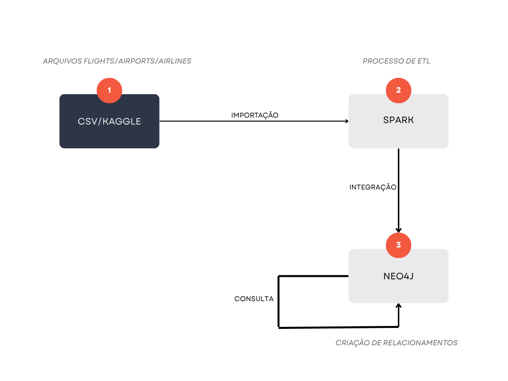

# Análise de cancelamento de voos

**Universidade Federal de São Carlos - UFSCar Sorocaba**
**Bacharelado em Ciência da Computação**

**Disciplina:** Processamento Massivo de Dados
**Professora:** Dra. Sahudy Montenegro González

**Fase Intermediária I**

**Autores:**

* Matheus Rodrigues Ferreira - 813919
* Vinícius Fernandes Terra Silva - 814146

---

## 1. Objetivos

O objetivo deste projeto prático é explorar e analisar atributos de atrasos de voos comerciais nos Estados Unidos, a partir do dataset “2015 Flight Delays and Cancellations” disponível no Kaggle.
Essa análise é pertinente pois visa transformar dados de aviação civil em insights estratégicos e operacionais que permitam otimizar operações, reduzir custos e melhorar a experiência do passageiro através da análise inteligente de conectividade aérea.
O primeiro grande objetivo seria mapear e visualizar toda a rede de conectividade aérea, permitindo que gestores aeroportuários, companhias aéreas e órgãos reguladores entendam como os aeroportos se conectam, quais são os principais hubs, onde existem gargalos e como o tráfego flui pela rede. Este mapeamento seria fundamental para identificar oportunidades de novas rotas baseadas em análise de gaps de conectividade, onde passageiros precisam fazer conexões desnecessárias ou onde existe demanda não atendida entre pares de cidades.
Um objetivo operacional crítico seria a análise de performance e confiabilidade, permitindo identificar padrões de atrasos, cancelamentos e problemas operacionais que se propagam pela rede. O sistema permitiria simular cenários de contingência, respondendo perguntas como "se o aeroporto de Atlanta fechar por condições climáticas, quantas rotas indiretas ficam comprometidas?" ou "qual seria o impacto na rede se uma determinada companhia aérea suspender operações?". Esta capacidade de análise de cascata seria valiosa para o planejamento de contingência e gestão de crises.

**Consultas principais:**

### Análises de Performance

* Ranking de companhias por atraso médio e taxa de cancelamento
* Identificação de aeroportos problemáticos (maior concentração de atrasos)

### Análises de Rede

* Identificação de aeroportos hub (maior conectividade)
* Buscar por todas as rotas ou conexões indiretas (voos com escalas)
* Aeroportos isolados ou mal conectados (ilhas)
* Se o aeroporto X for fechado ainda podemos sair do aeroporto A e chegar no B?

---

## 2. Tecnologias Escolhidas

**Apache Spark:** utilizaremos o Apache Spark como motor principal de processamento distribuído para ingerir, limpar e transformar o grande volume de registros do dataset de voos. Com APIs em PySpark, conseguiremos carregar tensões de milhões de linhas em memória distribuída, tratar valores faltantes, ajustar fusos e computar agregações complexas (por exemplo, médias e percentuais de atraso) de forma eficiente e escalável. Sua capacidade de paralelizar tarefas em clusters torna-o ideal para o estágio de ETL (Extração, Transformação e Carga) deste projeto, garantindo desempenho mesmo diante de datasets crescentes.

**Neo4j:** o Neo4j será o repositório de dados em grafo no qual iremos modelar os nossos aeroportos, companhias aéreas, aeronaves e rotas como elementos interconectados. O paradigma de grafo reflete naturalmente a rede de voos, permitindo consultas de vizinhança (por exemplo, “quais companhias operam entre X e Y?”), métricas de centralidade (identificação de hubs) e detecção de sub-redes críticas. A linguagem Cypher facilita a formulação dessas queries e o próprio Neo4j oferece indexação e otimização específicas para grafos, garantindo respostas rápidas mesmo em estruturas densas.

---

## 3. Fontes de Dados

* Dataset “2015 Flight Delays and Cancellations”
  Disponível em: [https://www.kaggle.com/datasets/usdot/flight-delays?select=flights.csv](https://www.kaggle.com/datasets/usdot/flight-delays?select=flights.csv)
  Contém: data, códigos de aeroporto de origem e destino, companhia, número do voo, horários programados e reais de partida/chegada, código de aeronave, atraso em minutos, entre outras colunas.

---

## 4. Fluxograma Minimundo

